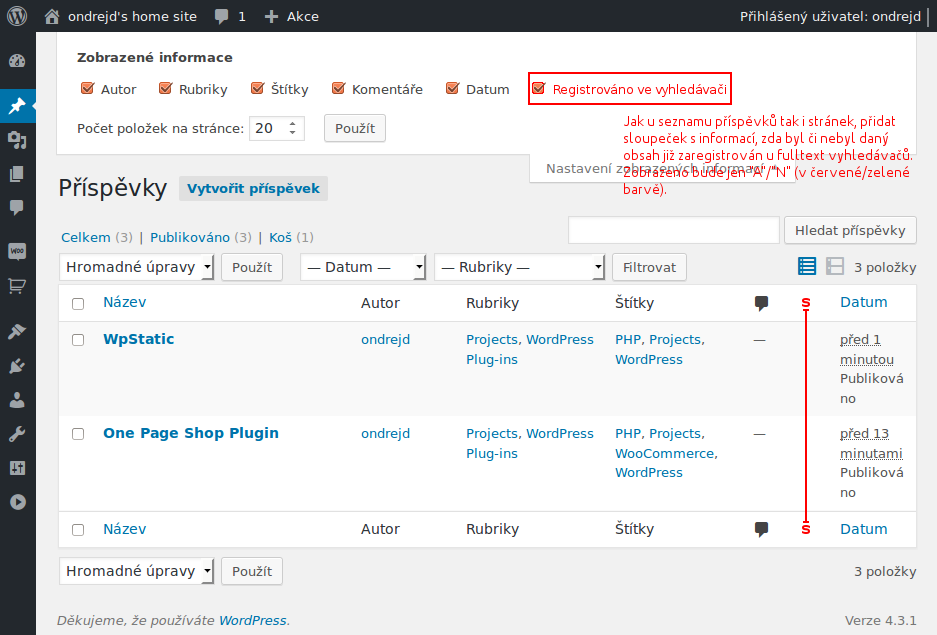

# Seznam Fulltext Plugin

Plugin pro [WordPress](https://wordpress.org/), který umožňuje snadnější registraci obsahu v rámci fulltext vyhledávače [Seznam.cz](http://www.seznam.cz/).

## Instalace

1. stáhněte poslední verzi pluginu z jeho domovské stránky [ondrejd/odwp-seznamfulltext](https://bitbucket.com/ondrejd/odwp-seznamfulltext/downloads)
2. rozbalte stažený archiv do složky `wp-content/plugins` vaší instalace aplikace [WordPress](https://wordpress.org/) - po rozbalení by měla být vytvořena nová složka `odwp-seznamfulltext`
3. přejděte do administrace aplikace [WordPress](https://wordpress.org/) a aktivujte plugin __Seznam Fulltext Plugin__.

To je vše - nyní by plugin měl být úspěšně nainstalován.

## Použití

### Nastavení

Plugin __Seznam Fulltext Plugin__ umožňuje poměrně rozsáhlé nastavení týkající se stanovení obsahu, který má podléhat registraci u fulltextového vyhledávače. Mimo běžný obsah aplikace [WordPress](https://wordpress.org/) - příspěvky a stránky - podporuje __Seznam Fulltext Plugin__ i plugin [WooCommerce](https://wordpress.org/plugins/woocommerce/), takže registraci mohou podléhat i produkty tímto pluginem definované.

Níže je snímek obrazovky z administrace aplikace [WordPress](https://wordpress.org/) s nainstalovaným pluginem [WooCommerce](https://wordpress.org/plugins/woocommerce/):

## TODO

- [x] __Stránka s nastavením__
    - [x] základní nastavení (jaký obsah podléha registraci, kolikrát se o registraci pokusit)
    - [x] rozšířené nastavení (__WooCommerce__)
    - [ ] přidat možnost zobrazit/skrýt filtr `Dle registrace` v seznamu příspěvků
- [ ] __Automatická registrace__ - provést samotnou automatickou registraci (prosté volání URL adresy se správnými parametry) na základě aktuálního nastavení.
- [ ] __Stránky s výpisem příspěvků/stránek__
    - [x] přidat sloupec (pouze s `A`/`N`) dle toho zda je obsah registrován či ne.
      
    - [ ] přidat filtrování dle toho, zda byl obsah zaregistrován u vyhledávačů či ne.
- [ ] __Stránky pro vytváření/úpravu příspěvků__
    - [x] na stránku přidávání přidat _checkbox_ `Přeskočit registraci u Seznam.cz`.
    - [x] při přidávání příspěvku musíme uložit stav _checkboxu_ `Přeskočit registraci u Seznam.cz`.
    - [x] při editaci příspěvku zobrazíme info zda byl již obsah zaregistrován či ne a _checkbox_ `Přeskočit registraci u Seznam.cz` (se správným stavem).

## ChangeLog

### Verze 0.1.0

- počáteční verze
- stránka s nastavením
